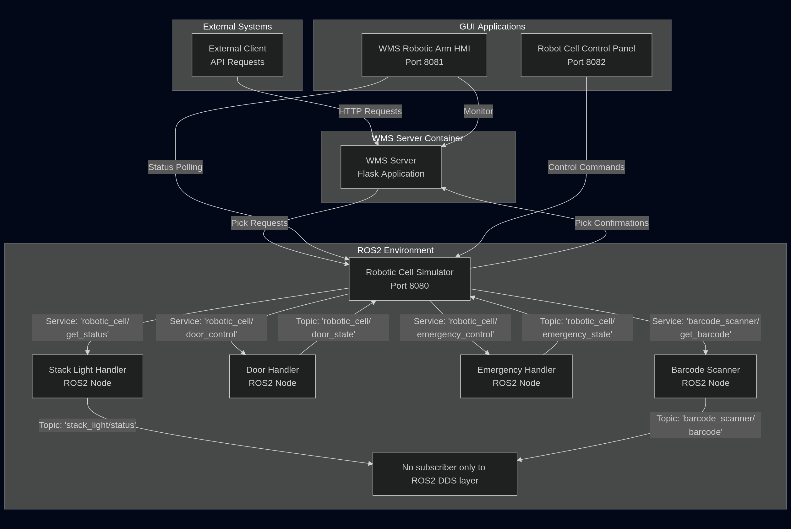

# Robotic cell simulation Project

<div align="center"> 
    
</div>


This project simulates a robotic cell with 3-DOF robotic arm control, stack light monitoring, door/emergency controls, and  WMS communication. Check overall software architecture of this project below:


<div align="center"> 
    
</div>


## Project Overview

The system consists of three main components:
- **ROS2 Robot Cell Simulation**: Simulates robotic cell hardware including arm, door, emergency button, barcode scanner, and stack light.
- **WMS robotic cell HMI**: PyQt5-based graphical interface showing real-time arm movement and system status.
In this panel robot moves each time after recieving pick request to random target pose and then returns back to home position. 
- **Control Panel**: Separate GUI panel for controlling cell door and emergency button. By default on startup the cell door is open and user needs to close it via this panel.

## Project Structure

```
robotic_cell_simulation/
│       
├── robot_cell_ros2_pkg/
│   └── robotic_cell_area_simulation/
│       ├── scripts/
│       │   ├── robotic_cell_simulator.py      # Main robot cell simulator
│       │   ├── barcode_scanner.py             # Barcode scanner simulation
│       │   ├── door_handler.py                # Door control handler
│       │   ├── emergency_button_handler.py    # Emergency button handler
│       │   └── stack_light_handler.py         # Stack light controller
│       ├── launch/
│       │   └── cell_simulation.launch.py      # Launch all components
│       │
│       ├── package.xml
│       └── CMakeLists.txt
│       
├── run_all.sh
├── test_system.sh
│       
└── wms_gui_pkg/
    ├── robot_cell_monitor.py                  # Main WMS GUI with arm visualization
    └── robot_cell_control.py                  # Control panel for door and emergency button
```

## Installation Requirements

### 1. ROS2 Humble Installation
Check the ros2 humble installation [Guide](https://docs.ros.org/en/humble/Installation.html) 
- After installation, create your own ros2 workspace

### 2. Build ROS2 Package

Make sure 'robotic_cell_area_simulation' pkg is in the 'src' directory of your ros2 workspace.
Then run below commands: 

```bash
source /opt/ros/humble/setup.bash
colcon build
```


### 3. Install Python Dependencies

```bash
# Create a virtual enviroment
python3 -m venv robotic_cell_venv

# Activate the virtual enviroment
source ~/robotic_cell_venv/bin/activate

# Install Python packages
pip install -r requirements.txt 
```


## Running the System

```bash
# Activate the virtual enviroment that created in previous step
source ~/robotic_cell_venv/bin/activate

source install/setup.bash

# Run all required scripts and nodes
./run_all.sh

```

## Test the system
```bash
# Run test bash script
./test_system.sh
```


## System Ports and Communication

- **Robot Cell Simulator**: HTTP server on port `8080`
- **WMS GUI**: HTTP server on port `8081` (receives pick requests)
- **WMS Monitoring**: HTTP server on port `8082` (communication logging)
- **WMS Server**: Expected on port `5000` (for pick confirmations)

## Features

### Robot Cell Simulation (ROS2)
- 3-DOF robotic arm simulation with forward/inverse kinematics
- Door control (open/close) with safety interlocks
- Emergency button activation/deactivation
- Barcode scanner with random 5-digit codes
- Stack light status (Red/Yellow/Green + Buzzer)
- HTTP API for external control

### WMS GUI
- Real-time 3D arm visualization with smooth animations
- Stack light status display
- WMS communication monitoring
- Activity logging
- Pick request processing

### Control Panel
- Door control interface (open/close)
- Emergency button control (activate/deactivate)
- Status logging

## API Endpoints

### Robot Cell Simulator (port 8080)
- `GET /health` - Health check
- `GET /status` - Robot status
- `GET /stack_light/status` - Stack light status
- `POST /pick` - Process pick request
- `POST /door` - Control door
- `POST /emergency` - Control emergency button

### WMS GUI (port 8081)
- `GET /health` - Health check
- `GET /status` - GUI status
- `POST /pick` - Receive pick requests

## Safety Features

- Door must be closed for robot operations
- Emergency button prevents robot movement for pick operation
- Stack light indicates system status:
  - 🟢 Green: Normal operation
  - 🟡 Yellow: Door open or robot working
  - 🔴 Red: Emergency activated
  - 🔊 Buzzer: Emergency state

## Troubleshooting

1. **ROS2 components not starting**: Ensure ROS2 is sourced and package is built
2. **GUI not connecting**: Check if robot simulator is running on port 8080
3. **Pick requests failing**: Verify door is closed and emergency is deactivated
4. **Stack light not updating**: Check ROS2 communication between components
